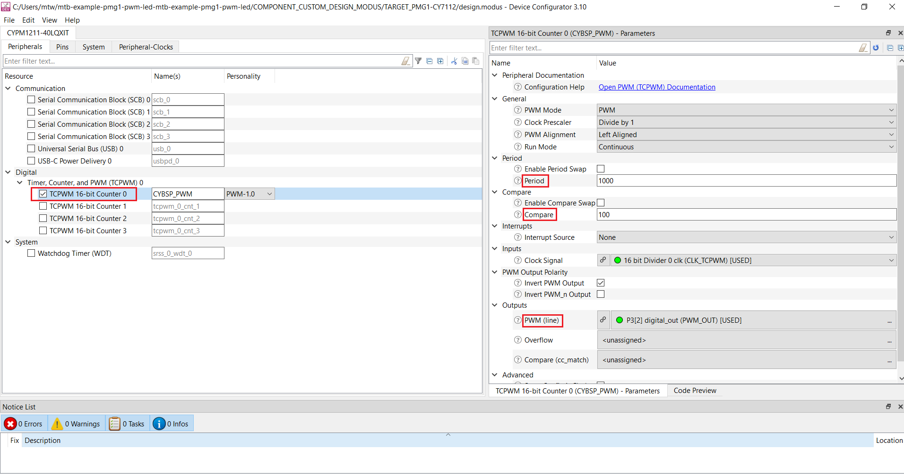

# EZ-PD&trade; PMG1 MCU: PWM LED

This code example demonstrates the usage of the TCPWM block in EZ-PD&trade; PMG1 MCU in PWM mode to generate PWM signals of configurable duty cycle to blink the onboard LED at 1 Hz.

[View this README on GitHub.](https://github.com/Infineon/mtb-example-pmg1-pwm-led)

[Provide feedback on this code example.](https://cypress.co1.qualtrics.com/jfe/form/SV_1NTns53sK2yiljn?Q_EED=eyJVbmlxdWUgRG9jIElkIjoiQ0UyMzM2NjciLCJTcGVjIE51bWJlciI6IjAwMi0zMzY2NyIsIkRvYyBUaXRsZSI6IkVaLVBEJnRyYWRlOyBQTUcxIE1DVTogUFdNIExFRCIsInJpZCI6ImFiaHAiLCJEb2MgdmVyc2lvbiI6IjIuMS4wIiwiRG9jIExhbmd1YWdlIjoiRW5nbGlzaCIsIkRvYyBEaXZpc2lvbiI6Ik1DRCIsIkRvYyBCVSI6IldJUkVEIiwiRG9jIEZhbWlseSI6IlRZUEUtQyJ9)


## Requirements

- [ModusToolbox&trade;](https://www.infineon.com/modustoolbox) v3.0 or later (tested with v3.0)
- Board support package (BSP) minimum required version: 3.0.0
- Programming language: C
- Associated parts: All [EZ-PD&trade; PMG1 MCU](https://www.infineon.com/PMG1) parts


## Supported toolchains (make variable 'TOOLCHAIN')

- GNU Arm&reg; Embedded Compiler v10.3.1 (`GCC_ARM`) – Default value of `TOOLCHAIN`
- Arm&reg; Compiler v6.13 (`ARM`)
- IAR C/C++ Compiler v8.42.2 (`IAR`)


## Supported kits (make variable 'TARGET')

- [EZ-PD&trade; PMG1-S0 Prototyping Kit](https://www.infineon.com/CY7110) (`PMG1-CY7110`) – Default value of `TARGET`
- [EZ-PD&trade; PMG1-S1 Prototyping Kit](https://www.infineon.com/CY7111) (`PMG1-CY7111`)
- [EZ-PD&trade; PMG1-S2 Prototyping Kit](https://www.infineon.com/CY7112) (`PMG1-CY7112`)
- [EZ-PD&trade; PMG1-S3 Prototyping Kit](https://www.infineon.com/CY7113) (`PMG1-CY7113`)
- [EZ-PD&trade; PMG1-B1 Prototyping Kit](https://www.infineon.com/EVAL_PMG1_B1_DRP) (`EVAL_PMG1_B1_DRP`)


## Hardware setup

1. Make the following hardware connections to route the PWM signal generated by the TCPWM block to the output user LED (LED3):

   **Table 1. LED input connection**

    PMG1 prototyping kit | PWM output to LED input     
    :-------------------| :-------------------------
    PMG1-CY7110         | No connection required 
    PMG1-CY7111         | J6.16 (P1.2) to J6.6 (LED3 IN) 
    PMG1-CY7112         | J6.11 (P3.2) to J6.6 (LED3 IN) 
    PMG1-CY7113         | J6.12 (P3.0) to J6.6 (LED3 IN) 
    PMG1-CY7113         | J6.12 (P3.0) to J6.6 (LED3 IN) 
    EVAL_PMG1_B1_DRP    | J7.8 (P2.1) to J6.7 (USER_STATUS_LED) 
   
   <br>

2. If UART DEBUG PRINT messages are enabled, UART connection are needed. Pin connections for UART is as shown in the following table. For the following revisions of the PMG1 prototyping kits, connect the UART Tx and UART Rx lines from the PMG1 kit to J3.8 and J3.10 on KitProg3 respectively to establish a UART connection between KitProg3 and the PMG1 device.

   **Table 2. Pin connections for UART**

    PMG1 kit | UART Tx | UART Rx 
    :-------       | :------------ | :----------     
    PMG1-CY7110 (revision 3 or lower)   | J6.10 to J3.8  | J6.9 to J3.10   
    PMG1-CY7111 (revision 2 or lower) | J6.10 to J3.8 | J6.9 to J3.10 
    PMG1-CY7112 (revision 2 or lower) | J6.10 to J3.8 | J6.9 to J3.10 
    PMG1-CY7113 (revision 3 or lower) | J6.10 to J3.8 | J6.9 to J3.10 
    EVAL_PMG1_B1_DRP | SW5 to 1-2 position | SW4 to 1-2 position 
   
   <br>

   > **Note:** All prototyping kits with a higher revision have UART lines internally connected. Therefore, external wiring is not required.

See the kit user guide for more details on configuring the board.

## Software setup

See the [ModusToolbox&trade; tools package installation guide](https://www.infineon.com/ModusToolboxInstallguide) for information about installing and configuring the tools package.
This example requires no additional software or tools.


## Using the code example

### Create the project

The ModusToolbox&trade; tools package provides the Project Creator as both a GUI tool and a command line tool.

<details><summary><b>Use Project Creator GUI</b></summary>

1. Open the Project Creator GUI tool.

   There are several ways to do this, including launching it from the dashboard or from inside the Eclipse IDE. For more details, see the [Project Creator user guide](https://www.infineon.com/ModusToolboxProjectCreator) (locally available at *{ModusToolbox&trade; install directory}/tools_{version}/project-creator/docs/project-creator.pdf*).

2. On the **Choose Board Support Package (BSP)** page, select a kit supported by this code example. See [Supported kits](#supported-kits-make-variable-target).

   > **Note:** To use this code example for a kit not listed here, you may need to update the source files. If the kit does not have the required resources, the application may not work.

3. On the **Select Application** page:

   a. Select the **Applications(s) Root Path** and the **Target IDE**.

   > **Note:** Depending on how you open the Project Creator tool, these fields may be pre-selected for you.

   b.	Select this code example from the list by enabling its check box.

   > **Note:** You can narrow the list of displayed examples by typing in the filter box.

   c. (Optional) Change the suggested **New Application Name** and **New BSP Name**.

   d. Click **Create** to complete the application creation process.

</details>

<details><summary><b>Use Project Creator CLI</b></summary>

The 'project-creator-cli' tool can be used to create applications from a CLI terminal or from within batch files or shell scripts. This tool is available in the *{ModusToolbox&trade; install directory}/tools_{version}/project-creator/* directory.

Use a CLI terminal to invoke the 'project-creator-cli' tool. On Windows, use the command-line 'modus-shell' program provided in the ModusToolbox&trade; installation instead of a standard Windows command-line application. This shell provides access to all ModusToolbox&trade; tools. You can access it by typing "modus-shell" in the search box in the Windows menu. In Linux and macOS, you can use any terminal application.

The following example clones the "[mtb-example-pmg1-pwm-led](https://github.com/Infineon/mtb-example-pmg1-pwm-led)" application with the desired name "MyPwmLed" configured for the *PMG1-CY7110* BSP into the specified working directory, *C:/mtb_projects*:

   ```
   project-creator-cli --board-id PMG1-CY7110 --app-id mtb-example-pmg1-pwm-led --user-app-name MyPwmLed --target-dir "C:/mtb_projects"
   ```

The 'project-creator-cli' tool has the following arguments:

Argument | Description | Required/optional
---------|-------------|-----------
`--board-id` | Defined in the <id> field of the [BSP](https://github.com/Infineon?q=bsp-manifest&type=&language=&sort=) manifest | Required
`--app-id`   | Defined in the <id> field of the [CE](https://github.com/Infineon?q=ce-manifest&type=&language=&sort=) manifest | Required
`--target-dir`| Specify the directory in which the application is to be created if you prefer not to use the default current working directory | Optional
`--user-app-name`| Specify the name of the application if you prefer to have a name other than the example's default name | Optional

<br>

> **Note:** The project-creator-cli tool uses the `git clone` and `make getlibs` commands to fetch the repository and import the required libraries. For details, see the "Project creator tools" section of the [ModusToolbox&trade; tools package user guide](https://www.infineon.com/ModusToolboxUserGuide) (locally available at {ModusToolbox&trade; install directory}/docs_{version}/mtb_user_guide.pdf).

</details>


### Open the project

After the project has been created, you can open it in your preferred development environment.


<details><summary><b>Eclipse IDE</b></summary>

If you opened the Project Creator tool from the included Eclipse IDE, the project will open in Eclipse automatically.

For more details, see the [Eclipse IDE for ModusToolbox&trade; user guide](https://www.infineon.com/MTBEclipseIDEUserGuide) (locally available at *{ModusToolbox&trade; install directory}/docs_{version}/mt_ide_user_guide.pdf*).

</details>


<details><summary><b>Visual Studio (VS) Code</b></summary>

Launch VS Code manually, and then open the generated *{project-name}.code-workspace* file located in the project directory.

For more details, see the [Visual Studio Code for ModusToolbox&trade; user guide](https://www.infineon.com/MTBVSCodeUserGuide) (locally available at *{ModusToolbox&trade; install directory}/docs_{version}/mt_vscode_user_guide.pdf*).

</details>


<details><summary><b>Keil µVision</b></summary>

Double-click the generated *{project-name}.cprj* file to launch the Keil µVision IDE.

For more details, see the [Keil µVision for ModusToolbox&trade; user guide](https://www.infineon.com/MTBuVisionUserGuide) (locally available at *{ModusToolbox&trade; install directory}/docs_{version}/mt_uvision_user_guide.pdf*).

</details>


<details><summary><b>IAR Embedded Workbench</b></summary>

Open IAR Embedded Workbench manually, and create a new project. Then select the generated *{project-name}.ipcf* file located in the project directory.

For more details, see the [IAR Embedded Workbench for ModusToolbox&trade; user guide](https://www.infineon.com/MTBIARUserGuide) (locally available at *{ModusToolbox&trade; install directory}/docs_{version}/mt_iar_user_guide.pdf*).

</details>


<details><summary><b>Command line</b></summary>

If you prefer to use the CLI, open the appropriate terminal, and navigate to the project directory. On Windows, use the command-line 'modus-shell' program; on Linux and macOS, you can use any terminal application. From there, you can run various `make` commands.

For more details, see the [ModusToolbox&trade; tools package user guide](https://www.infineon.com/ModusToolboxUserGuide) (locally available at *{ModusToolbox&trade; install directory}/docs_{version}/mtb_user_guide.pdf*).

</details>


## Operation

1. Ensure the steps listed in the [Hardware setup](#hardware-setup) section are completed.

2. For PMG1-CY7110, PMG1-CY7111, PMG1-CY7112, and PMG1-CY7113 prototyping kits, ensure that the jumper shunt on the power selection jumper (J5) is placed at position 2-3 to enable programming mode. Skip this step for EVAL_PMG1_B1_DRP kit.

3. Connect the board to your PC using the USB cable through the KitProg3 USB Type-C port (J1).

4. Program the board using one of the following:

   <details><summary><b>Using Eclipse IDE</b></summary>

      1. Select the application project in the Project Explorer.

      2. In the **Quick Panel**, scroll down, and click **\<Application Name> Program (KitProg3_MiniProg4)**.
   </details>


   <details><summary><b>In other IDEs</b></summary>

   Follow the instructions in your preferred IDE.
   </details>


   <details><summary><b>Using CLI</b></summary>

     From the terminal, execute the `make program` command to build and program the application using the default toolchain to the default target. The default toolchain is specified in the application's Makefile but you can override this value manually:
      ```
      make program TOOLCHAIN=<toolchain>
      ```

      Example:
      ```
      make program TOOLCHAIN=GCC_ARM
      ```
   </details>

5. After programming the kit, disconnect the USB cable. 

6. For PMG1-CY7110, PMG1-CY7111, PMG1-CY7112, and PMG1-CY7113 prototyping kits, change the position on the power selection jumper (J5) to 1-2 to power the kit through the USB PD port (J10). Skip this step for the EVAL_PMG1_B1_DRP kit. 

7. Connect the PMG1 USB PD sink port (J10) to the PC or a power adapter using a USB Type-C cable to power the PMG1-CY7110, PMG1-CY7111, PMG1-CY7112, and PMG1-CY7113 prototyping kits. Skip this step for the EVAL_PMG1_B1_DRP kit as it is automatically powered when the kit is connected through the KitProg3 USB Type-C port (J1).

8. The application starts automatically. Confirm that the onboard user LED (LED3) blinks at 1 Hz with the 10% duty cycle (default) as defined in `PWM_DUTY_CYCLE` in the *main.c* file.

9. Vary the duty cycle in percentage of the PWM period by modifying the value of `PWM_DUTY_CYCLE` and observe the difference in LED ON and LED OFF time.

## Debugging

You can debug the example to step through the code. 

<details><summary><b>In Eclipse IDE</b></summary>

Use the **\<Application Name> Debug (KitProg3_MiniProg4)** configuration in the **Quick Panel**. Ensure that the board is connected to your PC using the USB cable through the KitProg3 USB Type-C port (J1) and for PMG1-CY7110, PMG1-CY7111, PMG1-CY7112, and PMG1-CY7113 prototyping kits the jumper shunt on power selection jumper (J5) is placed at position 1-2.

See the **Debug mode** section in the kit user guide for debugging the application on the CY7110 prototyping kit. See the **Debugging using ModusToolbox&trade;** section in [AN238945](https://infineon.com/AN238945) for EVAL_PMG1_B1_DRP kit. For more details, see the **Program and debug** section in the [Eclipse IDE for ModusToolbox&trade; user guide](https://www.infineon.com/MTBEclipseIDEUserGuide).

</details>


<details><summary><b>In other IDEs</b></summary>

Follow the instructions in your preferred IDE.
</details>

See the "Debug mode" section in the kit user guide for debugging the application on the CY7110 prototyping kit. For more details, see the "Program and debug" section in the [Eclipse IDE for ModusToolbox&trade; software user guide](https://www.infineon.com/MTBEclipseIDEUserGuide).


## Design and implementation

The TCPWM block runs a 16-bit counter that can be configured as timer, counter, PWM, or quadrature decoder. In this example, the TCPWM block is configured in PWM mode (left-aligned) to generate a PWM signal of the required duty cycle. The TCPWM peripheral is assigned a clock signal of frequency 1 kHz.

To generate a PWM signal with time period as 1 second, the required TCPWM period count value can be calculated as follows:

    TCPWM period count value = PWM time period * TCPWM clock frequency                    
                             = 1 * 1000
                             = 1000 counts 
                         
The TCPWM compare value is used to set the duty cycle of the PWM signal. Whenever the count value reaches the compare value or when the counter overflows, the PWM output signal changes the state resulting in both ON and OFF time based on the compare value chosen. The PWM output is inverted to feed the active LOW driven user LED (LED3). 

To generate a PWM signal with 10% duty cycle, the required TCPWM compare value can be calculated as follows:

    TCPWM compare count value = TCPWM period count value * duty cycle / 100                   
                              = 1000 * 10 / 100
                              = 100 counts 

> **Note:** For more details on the configuration of TCPWM in the PWM mode, see the device-specific Architecture Technical Reference Manual (TRM).

This example uses the following configuration for the TCPWM block:

**Table 2. TCPWM block settings**

   PWM mode           | PWM 
   :------------------ | :------------------------------------
   Clock prescaler    | Divide by 1 
   PWM alignment      | Left aligned
   Run mode           | Continuous 
   Period             | 1000
   Compare            | 100  
   Interrupt source   | None
   Invert PWM output  | Yes 
   Clock frequency    | 1 kHz

<br>

**Figure 1. TCPWM configuration in the PWM mode**




### Compile-time configurations
The EZ-PD&trade; PMG1 MCU PWM LED application functionality can be customized through a set of compile-time parameters that can be turned ON/OFF through the *main.c* header file.

**Table 3. Compile-time configurations**

 Macro name          | Description                           | Allowed values 
 :------------------ | :------------------------------------ | :------------- 
 `DEBUG_PRINT`     | Debug print macro to enable UART print | Should be set to 1u to enable <br> 0u to disable
 
 <br>
 
### Resources and settings

**Table 4. Application resources**

 Resource   | Alias/object   | Purpose                              
 :--------  | :------------- | :----------------------------------- 
 TCPWM (PDL)| CYBSP_PWM      | TCPWM block configured as PWM        
 GPIO (PDL) | PWM_OUT        | Output PWM signal from TCPWM block   
 LED (BSP)  | CYBSP_USER_LED | User LED to show the output          

<br>


## Related resources

Resources | Links
-----------|------------------
Application notes |[AN232553](https://www.infineon.com/AN232553) – Getting started with EZ-PD&trade; PMG1 MCU on ModusToolbox&trade; software <br> [AN232565](https://www.infineon.com/an232565) – EZ-PD&trade; PMG1 hardware design guidelines and checklist <br> [AN238945](https://www.infineon.com/AN238945) – Getting started with EZ-PD&trade; PMG1-B1 MCU using ModusToolbox&trade;
Code examples  | [Using ModusToolbox&trade;](https://github.com/Infineon/Code-Examples-for-ModusToolbox-Software) on GitHub
Device documentation | [EZ-PD&trade; PMG1 MCU datasheets](https://www.infineon.com/PMG1DS)
Development kits | Select your kits from the [Evaluation Board Finder](https://www.infineon.com/cms/en/design-support/finder-selection-tools/product-finder/evaluation-board).
Libraries on GitHub | [mtb-pdl-cat2](https://github.com/Infineon/mtb-pdl-cat2) – Peripheral Driver Library (PDL)
Tools  | [ModusToolbox&trade;](https://www.infineon.com/modustoolbox) – ModusToolbox&trade; software is a collection of easy-to-use libraries and tools enabling rapid development with Infineon MCUs for applications ranging from wireless and cloud-connected systems, edge AI/ML, embedded sense and control, to wired USB connectivity using PSoC&trade; Industrial/IoT MCUs, AIROC&trade; Wi-Fi and Bluetooth&reg; connectivity devices, XMC&trade; Industrial MCUs, and EZ-USB&trade;/EZ-PD&trade; wired connectivity controllers. ModusToolbox&trade; incorporates a comprehensive set of BSPs, HAL, libraries, configuration tools, and provides support for industry-standard IDEs to fast-track your embedded application development.

<br>


## Other resources

Infineon provides a wealth of data at [www.infineon.com](https://www.infineon.com) to help you select the right device, and quickly and effectively integrate it into your design.

## Document history

Document title: *CE233667* – *EZ-PD&trade; PMG1 MCU: PWM LED*

 Version | Description of change 
 ------- | --------------------- 
 1.0.0   | New code example      
 2.0.0   | Major update to support ModusToolbox&trade; v3.0. This version is not backward compatible with previous versions of ModusToolbox&trade; 
 2.1.0   | Update to support EVAL_PMG1_B1_DRP kit 
<br>


All referenced product or service names and trademarks are the property of their respective owners.

The Bluetooth&reg; word mark and logos are registered trademarks owned by Bluetooth SIG, Inc., and any use of such marks by Infineon is under license.


---------------------------------------------------------

© Cypress Semiconductor Corporation, 2022-2024. This document is the property of Cypress Semiconductor Corporation, an Infineon Technologies company, and its affiliates ("Cypress").  This document, including any software or firmware included or referenced in this document ("Software"), is owned by Cypress under the intellectual property laws and treaties of the United States and other countries worldwide.  Cypress reserves all rights under such laws and treaties and does not, except as specifically stated in this paragraph, grant any license under its patents, copyrights, trademarks, or other intellectual property rights.  If the Software is not accompanied by a license agreement and you do not otherwise have a written agreement with Cypress governing the use of the Software, then Cypress hereby grants you a personal, non-exclusive, nontransferable license (without the right to sublicense) (1) under its copyright rights in the Software (a) for Software provided in source code form, to modify and reproduce the Software solely for use with Cypress hardware products, only internally within your organization, and (b) to distribute the Software in binary code form externally to end users (either directly or indirectly through resellers and distributors), solely for use on Cypress hardware product units, and (2) under those claims of Cypress's patents that are infringed by the Software (as provided by Cypress, unmodified) to make, use, distribute, and import the Software solely for use with Cypress hardware products.  Any other use, reproduction, modification, translation, or compilation of the Software is prohibited.
<br>
TO THE EXTENT PERMITTED BY APPLICABLE LAW, CYPRESS MAKES NO WARRANTY OF ANY KIND, EXPRESS OR IMPLIED, WITH REGARD TO THIS DOCUMENT OR ANY SOFTWARE OR ACCOMPANYING HARDWARE, INCLUDING, BUT NOT LIMITED TO, THE IMPLIED WARRANTIES OF MERCHANTABILITY AND FITNESS FOR A PARTICULAR PURPOSE.  No computing device can be absolutely secure.  Therefore, despite security measures implemented in Cypress hardware or software products, Cypress shall have no liability arising out of any security breach, such as unauthorized access to or use of a Cypress product. CYPRESS DOES NOT REPRESENT, WARRANT, OR GUARANTEE THAT CYPRESS PRODUCTS, OR SYSTEMS CREATED USING CYPRESS PRODUCTS, WILL BE FREE FROM CORRUPTION, ATTACK, VIRUSES, INTERFERENCE, HACKING, DATA LOSS OR THEFT, OR OTHER SECURITY INTRUSION (collectively, "Security Breach").  Cypress disclaims any liability relating to any Security Breach, and you shall and hereby do release Cypress from any claim, damage, or other liability arising from any Security Breach.  In addition, the products described in these materials may contain design defects or errors known as errata which may cause the product to deviate from published specifications. To the extent permitted by applicable law, Cypress reserves the right to make changes to this document without further notice. Cypress does not assume any liability arising out of the application or use of any product or circuit described in this document. Any information provided in this document, including any sample design information or programming code, is provided only for reference purposes.  It is the responsibility of the user of this document to properly design, program, and test the functionality and safety of any application made of this information and any resulting product.  "High-Risk Device" means any device or system whose failure could cause personal injury, death, or property damage.  Examples of High-Risk Devices are weapons, nuclear installations, surgical implants, and other medical devices.  "Critical Component" means any component of a High-Risk Device whose failure to perform can be reasonably expected to cause, directly or indirectly, the failure of the High-Risk Device, or to affect its safety or effectiveness.  Cypress is not liable, in whole or in part, and you shall and hereby do release Cypress from any claim, damage, or other liability arising from any use of a Cypress product as a Critical Component in a High-Risk Device. You shall indemnify and hold Cypress, including its affiliates, and its directors, officers, employees, agents, distributors, and assigns harmless from and against all claims, costs, damages, and expenses, arising out of any claim, including claims for product liability, personal injury or death, or property damage arising from any use of a Cypress product as a Critical Component in a High-Risk Device. Cypress products are not intended or authorized for use as a Critical Component in any High-Risk Device except to the limited extent that (i) Cypress's published data sheet for the product explicitly states Cypress has qualified the product for use in a specific High-Risk Device, or (ii) Cypress has given you advance written authorization to use the product as a Critical Component in the specific High-Risk Device and you have signed a separate indemnification agreement.
<br>
Cypress, the Cypress logo, and combinations thereof, ModusToolbox, PSoC, CAPSENSE, EZ-USB, F-RAM, and TRAVEO are trademarks or registered trademarks of Cypress or a subsidiary of Cypress in the United States or in other countries. For a more complete list of Cypress trademarks, visit www.infineon.com. Other names and brands may be claimed as property of their respective owners.
